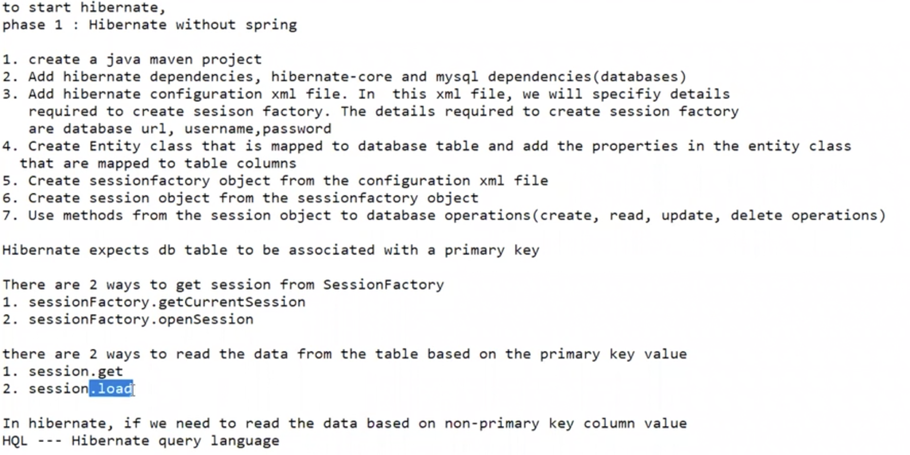

# Hibernate Basics


## Steps to create Hibernate application (this is without Spring)

1. Create a maven project.
2. Add hibernate and DB Driver dependencies as below:

```xml
	<!-- https://mvnrepository.com/artifact/mysql/mysql-connector-java -->
		<dependency>
			<groupId>mysql</groupId>
			<artifactId>mysql-connector-java</artifactId>
			<version>5.1.49</version>
		</dependency>


		<!-- https://mvnrepository.com/artifact/org.hibernate/hibernate-core -->
		<dependency>
			<groupId>org.hibernate</groupId>
			<artifactId>hibernate-core</artifactId>
			<version>5.4.27.Final</version>
		</dependency>
```
3. Create ``hibernate.cfg.xml`` file which is configuration file for hibernnate. Specify username, password, url etc.
4. Create an Entity Class(Check Student.class in this example)
5. Create a DAO and create a method to do CRUD operation. Session is mendatory for any CRUD operation in hibernate.

Example:
```java
SessionFactory factory = new Configuration()
				.configure("hibernate.cfg.xml")
				.addAnnotatedClass(Student.class)
				.buildSessionFactory();
Session session = factory.getCurrentSession();
session.getTransaction().begin();
session.save(student);
session.getTransaction().commit();
```
=> Ways to Read data from DB(2 ways):
Session.get
Session.load

These above APIs helps to read data from DB based on primary key. In order to read data based on non-primary-key, we need to use HQL.


### Get API:

```java
Session session = sf.getCurrentSession();
session.beginTransaction();// OR session.getTransaction().begin();
Student student = session.get(Student.class, studentId);
session.getTransaction().commit();//this is optional while reading data from DB
```

### Load API:


### Query#list() API:
Note: Query is from ``java org.hibernate.query.Query ``

```java
Session session = sf.getCurrentSession();
session.beginTransaction();// OR session.getTransaction().begin();
Student student = session.get(Student.class, studentId);
session.getTransaction().commit();//this is optional while reading data from DB
```

sessionFactory.getCurrentSession()
vs
sessionFactory.openSession()


